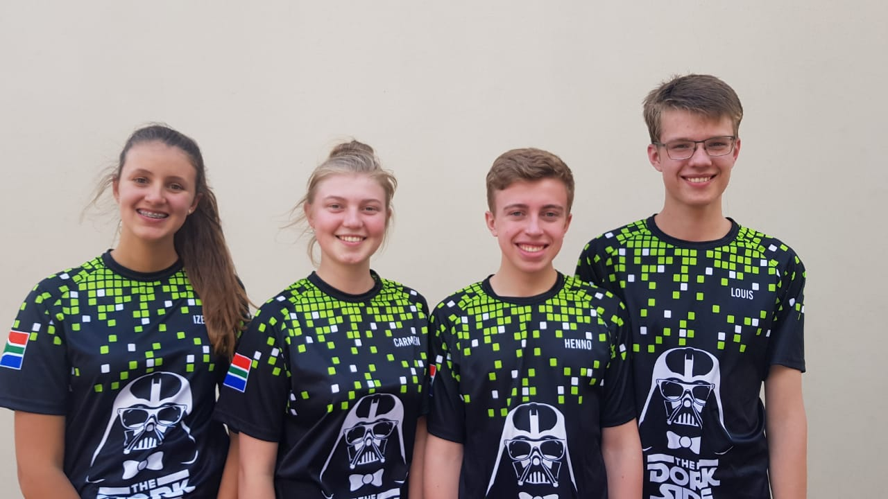

# Open Parking Manager
## AKA Findy Wheely Auto Mobily
### By the Dorkside
# About

This project serves as the open source repository of OpenParking manager, Currently as Louis Van der Walt's Expo 2020.

Originaly this was the github page for the [FLL](http://www.firstlegoleague.org/) team The Dorkside's research project. The design and programming was done by Louis van der Walt, one of the team members.



Team members left to right:

Izelle de Klerk, Caremen van't Wout, Henno van Wyk, Louis van der Walt.

This project is an attempt to create a free and open source system to find your vehicles parked at a shopping mall, airport or other closed parking. The problem this tries to solve is people losing their vehicle in large parking areas.This project also implements basic parking management functions like:
- Locating of vehicle
- Entry
- Tracking
- Payment (Representation)
- SQL database

Some features we plan to implement:
- Mobile Application
- Management Application

**Currently this project is not fit for use in a real world scenario.**

# Compiling
    TODO

# Contributing
    TODO

# Licence

All code is licensed under GPLv3, unless noted elsewhere. All technical drawings, documentation, schematics and images are licensed under CC-BY-SA, unless noted elsewhere.

```
OpenParkingManager - An open source parking manager and parking finder.
    Copyright (C) 2019 Louis van der Walt

    This program is free software: you can redistribute it and/or modify
    it under the terms of the GNU General Public License as published by
    the Free Software Foundation, either version 3 of the License, or 
    any later version.

    This program is distributed in the hope that it will be useful,
    but WITHOUT ANY WARRANTY; without even the implied warranty of
    MERCHANTABILITY or FITNESS FOR A PARTICULAR PURPOSE.  See the
    GNU General Public License for more details.

    You should have received a copy of the GNU General Public License
    along with this program.  If not, see <https://www.gnu.org/licenses/>.
```
```
This work is licensed under the Creative Commons Attribution-ShareAlike 4.0 International License. To view a copy of this license, visit http://creativecommons.org/licenses/by-sa/4.0/ or send a letter to Creative Commons, PO Box 1866, Mountain View, CA 94042, USA.
```
_Free as in freedom._


